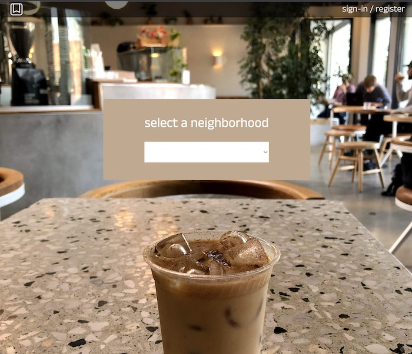
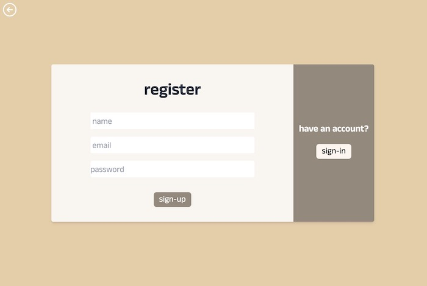
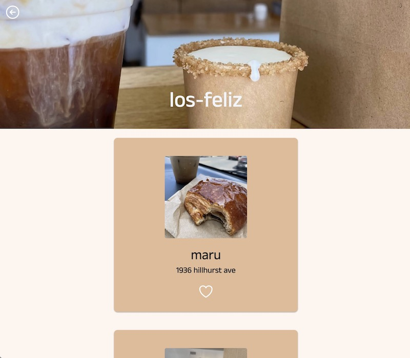

## Cafe Recs

Cafe recs uses the best that Next.js has to provide information about cafes in various neighborhoods is Los Angeles, Tokyo, and Seoul, all wrapped up in an aesthetically pleasing UI.

## Technologies

This web app uses Typescript, React, Next.js, MongoDB Atlas, TailwindCSS, and mongoDB.

